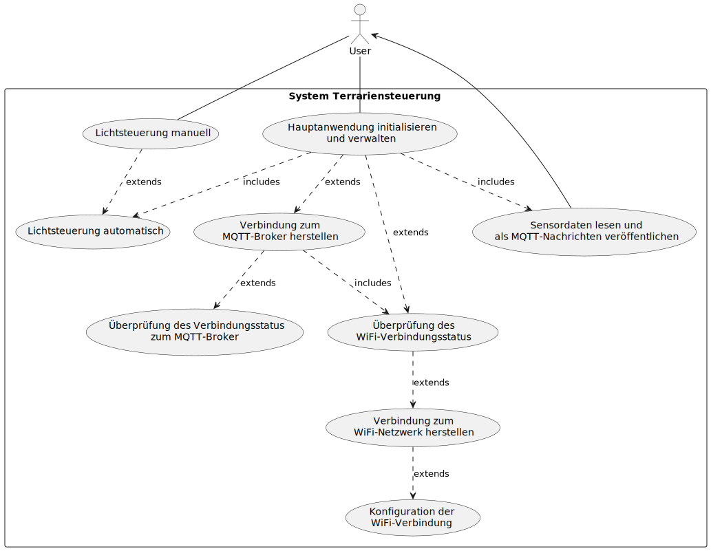
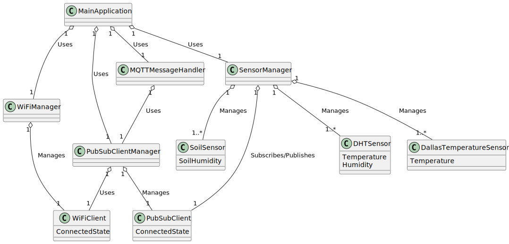
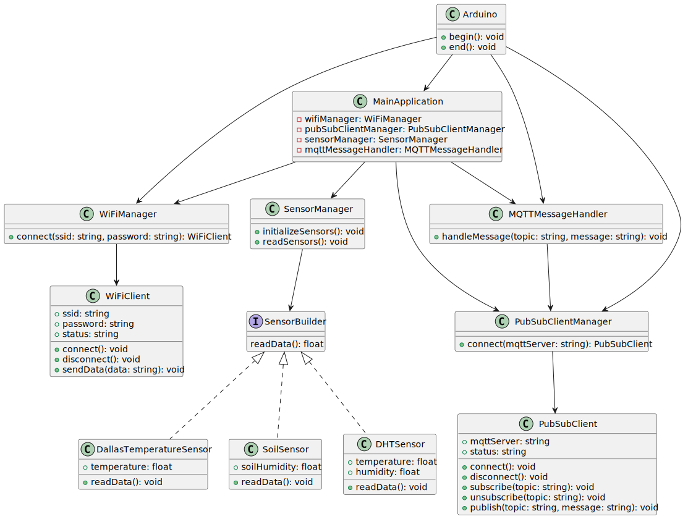

# Terra 1

Repo for the Mikrocontroller of Terra1

## Table of Contents

<!-- TOC -->
* [Terra 1](#terra-1)
  * [Table of Contents](#table-of-contents)
  * [Kurzbeschreibung](#kurzbeschreibung)
* [Design Phase](#design-phase)
  * [Use Case Diagramm](#use-case-diagramm)
  * [Domain Model](#domain-model)
  * [CRC Cards](#crc-cards)
    * [Class: WiFiManager](#class-wifimanager)
    * [Class: PubSubClientManager](#class-pubsubclientmanager)
    * [Class: SensorManager](#class-sensormanager)
    * [Class: LightController](#class-lightcontroller)
    * [Class: MQTTMessageHandler](#class-mqttmessagehandler)
    * [Class: MainApplication](#class-mainapplication)
  * [Use Case Specification](#use-case-specification)
    * [Use Case: Konfiguration der WiFi-Verbindung](#use-case-konfiguration-der-wifi-verbindung)
    * [Use Case: Überprüfung des WiFi-Verbindungsstatus](#use-case-überprüfung-des-wifi-verbindungsstatus)
    * [Use Case: Verbindung zum WiFi-Netzwerk herstellen](#use-case-verbindung-zum-wifi-netzwerk-herstellen)
    * [Use Case: Lokale IP-Adresse abrufen](#use-case-lokale-ip-adresse-abrufen)
    * [Use Case: Verbindung zum MQTT-Broker herstellen](#use-case-verbindung-zum-mqtt-broker-herstellen)
    * [Use Case: Überprüfung des Verbindungsstatus zum MQTT-Broker](#use-case-überprüfung-des-verbindungsstatus-zum-mqtt-broker)
    * [Use Case: Sensordaten lesen und als MQTT-Nachrichten veröffentlichen](#use-case-sensordaten-lesen-und-als-mqtt-nachrichten-veröffentlichen)
    * [Use Case: Hauptanwendung initialisieren und verwalten](#use-case-hauptanwendung-initialisieren-und-verwalten)
    * [Zusatz UseCase: Lichtsteuerung automatisch](#zusatz-usecase-lichtsteuerung-automatisch)
    * [Zusatz UseCase: Lichtsteuerung manuell](#zusatz-usecase-lichtsteuerung-manuell)
  * [Class Diagram](#class-diagram)
<!-- TOC -->

## Kurzbeschreibung

Diese Anwendung ist ein MQTT-basiertes Sensordatenerfassungs- und -steuerungssystem, das auf einem ESP32 
Mikrocontroller läuft.

Die Sensoren, die verwendet werden, sind:

1. DHT11: Ein preiswerter Temperatur- und Feuchtigkeitssensor. Die Daten werden alle 30 Sekunden gelesen und an einen MQTT-Broker gesendet.
2. DS18B20: Ein digitaler Temperatursensor, der auf dem 1-Wire-Protokoll basiert. Die gemessene Temperatur wird ebenfalls an den MQTT-Broker gesendet.
3. Fotoresistor: Ein Lichtempfindlichkeits-Sensor, dessen Auslesung an den MQTT-Broker gesendet wird.
4. Bodenwiderstandssensor: Ein Sensor, der die Feuchtigkeit des Bodens misst. Die Messwerte werden an den MQTT-Broker gesendet.

Während des Betriebs wird die Anwendung kontinuierlich die Sensorwerte lesen und an eine Datenbank senden. Dort kann der Nutzer die Daten auswerten. Die Daten werden zudem von einem Telegrambot verarbeitet der den Benutzer bei kritischen Werten alarmiert.

Dieses Programm könnte in einem Umfeld wie einer Smart-Home-Automatisierung integriert werden. Es bietet die Grundlage für eine Vielzahl von IoT-Projekten, da es die Fernsteuerung von Geräten und die Fernüberwachung von Sensordaten ermöglicht.

In einem nächsten Schritt wird der Controller ebenfalls das Licht und die Bewässerung steuern. Dazu wird eine Zeitschaltuhr implementiert und eingehende Nachrichten verarbeitet. Voraussetzung dafür ist allerdings die hardwareseitige Erweiterung des Controllers durch ein Relais.

# Design Phase

According to module 326

## Use Case Diagramm

## Domain Model

## CRC Cards

### Class: WiFiManager

**Responsibilities:**
- Configuriert die WiFi-Verbindung
- Überprüft den WiFi-Verbindungsstatus
- Stellt die Verbindung zum WiFi-Netzwerk her
- Gibt die lokale IP-Adresse zurück

**Collaborators:**
- WiFi
- WiFiMulti

### Class: PubSubClientManager

**Responsibilities:**
- Stellt die Verbindung zum MQTT-Broker her
- Überprüft den Verbindungsstatus zum MQTT-Broker
- Abonniert MQTT-Themen
- Veröffentlicht MQTT-Nachrichten

**Collaborators:**
- WiFiClient
- PubSubClient

### Class: SensorManager

**Responsibilities:**
- Liest die Sensordaten von DHT11, DS18B20, Photoresistor und Soil Resistor
- Konvertiert die Sensordaten in geeignete Formate
- Veröffentlicht die Sensordaten als MQTT-Nachrichten

**Collaborators:**
- DHTSensor
- DallasTemperatureSensor
- SoilSensor
- PubSubClient

### Class: LightController

**Responsibilities:**
- Schaltet das Licht ein
- Schaltet das Licht aus

**Collaborators:**
- PubSubClientManager

### Class: MQTTMessageHandler

**Responsibilities:**
- Verarbeitet eingehende MQTT-Nachrichten
- Ruft entsprechende Aktionen auf (z.B. Licht ein-/ausschalten)

**Collaborators:**
- PubSubClientManager
- LightController

### Class: MainApplication

**Responsibilities:**
- Initialisiert und verwaltet die Hauptanwendung
- Verbindet alle Komponenten
- Steuert den Ablauf des Programms

**Collaborators:**
- WiFiManager
- PubSubClientManager
- SensorManager
- MQTTMessageHandler
- LightController

## Use Case Specification

Eine Übersicht verschiedener UseCases, die das System erfüllen soll.

### Use Case: Konfiguration der WiFi-Verbindung

**Beschreibung:**
Dieser Use Case beschreibt den Vorgang, bei dem die WiFi-Verbindung konfiguriert wird.

**Akteure:**
- WiFiManager

**Vorbedingungen:**
- Verbindungsdetails wurden korrekt gespeichert.
- Die WiFiManager-Komponente ist initialisiert.

**Nachbedingungen:**
- Die WiFi-Verbindung wurde erfolgreich konfiguriert.

**Ablauf:**
1. Der Benutzer startet den Controller.
2. Der WiFiManager liest die WiFi-Verbindungsinformationen ein.
3. Der WiFiManager versucht die WiFi-Verbindung herzustellen.
4. Das System bestätigt die erfolgreiche Konfiguration der WiFi-Verbindung.

**Alternative Abläufe:**
- Schritt 4a: Wenn die WiFi-Verbindung fehlschlägt:
    - Das System zeigt eine Fehlermeldung an.
    - Das System wartet 30 sekunden.
    - Der Ablauf kehrt zu Schritt 3 zurück.

### Use Case: Überprüfung des WiFi-Verbindungsstatus

**Beschreibung:**
Dieser Use Case beschreibt den Vorgang, bei dem der WiFi-Verbindungsstatus überprüft wird.

**Akteure:**
- WiFiManager

**Vorbedingungen:**
- Die WiFiManager-Komponente ist initialisiert.

**Nachbedingungen:**
- Der WiFi-Verbindungsstatus wurde erfolgreich überprüft.

**Ablauf:**
1. Der WiFiManager überprüft den WiFi-Verbindungsstatus.
2. Das System gibt den aktuellen WiFi-Verbindungsstatus aus.

### Use Case: Verbindung zum WiFi-Netzwerk herstellen

**Beschreibung:**
Dieser Use Case beschreibt den Vorgang, bei dem eine Verbindung zum WiFi-Netzwerk hergestellt wird.

**Akteure:**
- WiFiManager

**Vorbedingungen:**
- Die WiFiManager-Komponente ist initialisiert.

**Nachbedingungen:**
- Die Verbindung zum WiFi-Netzwerk wurde erfolgreich hergestellt.

**Ablauf:**
1. Der WiFiManager stellt eine Verbindung zum WiFi-Netzwerk her.
2. Das System bestätigt die erfolgreiche Verbindung zum WiFi-Netzwerk.

### Use Case: Lokale IP-Adresse abrufen

**Beschreibung:**
Dieser Use Case beschreibt den Vorgang, bei dem die lokale IP-Adresse abgerufen wird.

**Akteure:**
- WiFiManager

**Vorbedingungen:**
- Die WiFiManager-Komponente ist initialisiert.
- Eine Verbindung zum WiFi-Netzwerk wurde erfolgreich hergestellt.

**Nachbedingungen:**
- Die lokale IP-Adresse wurde erfolgreich abgerufen.

**Ablauf:**
1. Der WiFiManager ruft die lokale IP-Adresse ab.
2. Das System gibt die abgerufene lokale IP-Adresse aus.

### Use Case: Verbindung zum MQTT-Broker herstellen

**Beschreibung:**
Dieser Use Case beschreibt den Vorgang, bei dem eine Verbindung zum MQTT-Broker hergestellt wird.

**Akteure:**
- PubSubClientManager

**Vorbedingungen:**
- Die PubSubClientManager-Komponente ist initialisiert.

**Nachbedingungen:**
- Die Verbindung zum MQTT-Broker wurde erfolgreich hergestellt.

**Ablauf:**
1. Der PubSubClientManager stellt eine Verbindung zum MQTT-Broker her.
2. Das System bestätigt die erfolgreiche Verbindung zum MQTT-Broker.

### Use Case: Überprüfung des Verbindungsstatus zum MQTT-Broker

**Beschreibung:**
Dieser Use Case beschreibt den Vorgang, bei dem der Verbindungsstatus zum MQTT-Broker überprüft wird.

**Akteure:**
- PubSubClientManager

**Vorbedingungen:**
- Die PubSubClientManager-Komponente ist initialisiert.

**Nachbedingungen:**
- Der Verbindungsstatus zum MQTT-Broker wurde erfolgreich überprüft.

**Ablauf:**
1. Der PubSubClientManager überprüft den Verbindungsstatus zum MQTT-Broker.
2. Das System gibt den aktuellen Verbindungsstatus zum MQTT-Broker aus.

### Use Case: Sensordaten lesen und als MQTT-Nachrichten veröffentlichen

**Beschreibung:**
Dieser Use Case beschreibt den Vorgang, bei dem Sensordaten von verschiedenen Sensoren gelesen und als MQTT-Nachrichten veröffentlicht werden.

**Akteure:**
- SensorManager

**Vorbedingungen:**
- Die SensorManager-Komponente ist initialisiert.
- Eine Verbindung zum MQTT-Broker wurde erfolgreich hergestellt.

**Nachbedingungen:**
- Die Sensordaten wurden erfolgreich gelesen.
- Die Sensordaten wurden erfolgreich als MQTT-Nachrichten veröffentlicht.

**Ablauf:**
1. Der SensorManager liest die Sensordaten von DHT11, DS18B20, Photoresistor und Soil Resistor.
2. Der SensorManager konvertiert die gelesenen Sensordaten in geeignete Formate.
3. Der SensorManager veröffentlicht die konvertierten Sensordaten als MQTT-Nachrichten.
4. Das System bestätigt das erfolgreiche Veröffentlichen der Sensordaten als MQTT-Nachrichten.

### Use Case: Hauptanwendung initialisieren und verwalten

**Beschreibung:**
Dieser Use Case beschreibt den Vorgang, bei dem die Hauptanwendung initialisiert und verwaltet wird.

**Akteure:**
- MainApplication

**Vorbedingungen:**
- Die erforderlichen Komponenten (WiFiManager, PubSubClientManager, SensorManager, MQTTMessageHandler, LightController) sind initialisiert und konfiguriert.

**Nachbedingungen:**
- Die Hauptanwendung wurde erfolgreich initialisiert und verwaltet.

**Ablauf:**
1. Die MainApplication initialisiert die erforderlichen Komponenten.
2. Die MainApplication verbindet alle Komponenten miteinander.
3. Die MainApplication steuert den Ablauf des Programms.

### Zusatz UseCase: Lichtsteuerung automatisch

**Beschreibung:**
Dieser Use Case beschreibt den Vorgang, bei dem die Lichtsteuerung automatisch, wie bei einer Zeitschaltuhr, durchgeführt wird. 
Dafür muss der Controller allerdings erst noch hardwareseitig erweitert werden.

**Akteure:**
- LightController

**Vorbedingungen:**
- Die erforderlichen Komponenten sind initialisiert und konfiguriert.

**Nachbedingungen:**
- Die Lichtsteuerung wurde erfolgreich durchgeführt und Licht wurde dementsprechend geschaltet.
- Eine Bestätigungsnachricht wurde erfolgreich als MQTT-Nachricht veröffentlicht.

**Ablauf:**
1. Die MainApplication ruft zu gegebener Zeit den LightController auf.
2. Der LightController überprüft den aktuellen Lichtstatus.
3. Der LightController schaltet das Licht entsprechend dem aktuellen Lichtstatus und der Uhrzeit an oder aus.

### Zusatz UseCase: Lichtsteuerung manuell

**Beschreibung:**
Dieser Use Case beschreibt den Vorgang, bei dem die Lichtsteuerung manuell durchgeführt wird. Dafür wertet der Microcontroller eingehende MQTT-Nachrichten aus und schaltet das Licht entsprechend an oder aus.
Dafür muss der Controller allerdings erst noch hardwareseitig erweitert werden.

**Akteure:**
- LightController
- MQTTMessageHandler

**Vorbedingungen:**
- Die erforderlichen Komponenten sind initialisiert und konfiguriert.
- Eine Verbindung zum MQTT-Broker wurde erfolgreich hergestellt.
- Das entsprechende MQTT-Topic wurde abonniert.

**Nachbedingungen:**
- Die Lichtsteuerung wurde erfolgreich durchgeführt und Licht wurde dementsprechend geschaltet.
- Eine Bestätigungsnachricht wurde erfolgreich als MQTT-Nachricht veröffentlicht.

**Ablauf:**
1. Der MQTTMessageHandler empfängt eine MQTT-Nachricht.
2. Der MQTTMessageHandler überprüft, ob die empfangene MQTT-Nachricht eine Lichtsteuerungsnachricht ist und ruft dementsprechend den LightManager auf.
3. Der LightManager überprüft den aktuellen Lichtstatus.
4. Der LightManager schaltet das Licht entsprechend dem aktuellen Lichtstatus an oder aus.
5. Der MQTTMessageHandler veröffentlicht eine Bestätigungsnachricht als MQTT-Nachricht.

## Class Diagram

## Projektstrukutr neu

- lib/ 
  - NetworkManager/ (Singleton Pattern)
    - NetworkManager.h 
    - NetworkManager.cpp
  - SensorFactory/ (Factory Pattern)
    - SensorFactory.h
    - SensorFactory.cpp
  - Sensor/
    - Sensor.h
    - DHTSensor.h
    - DHTSensor.cpp
    - DallasTemperatureSensor.h
    - DallasTemperatureSensor.cpp
  - MqttManager/ (Observer Pattern)
    - MqttManager.h
    - MqttManager.cpp
  - LightController/ (Command Pattern)
    - LightController.h
    - LightController.cpp
  - State/
    - SystemState.h (State Pattern)
    - ConnectingState.h
    - ConnectingState.cpp
    - ConnectedState.h
    - ConnectedState.cpp
- include/
  - Config.h
- src/
  - main.cpp