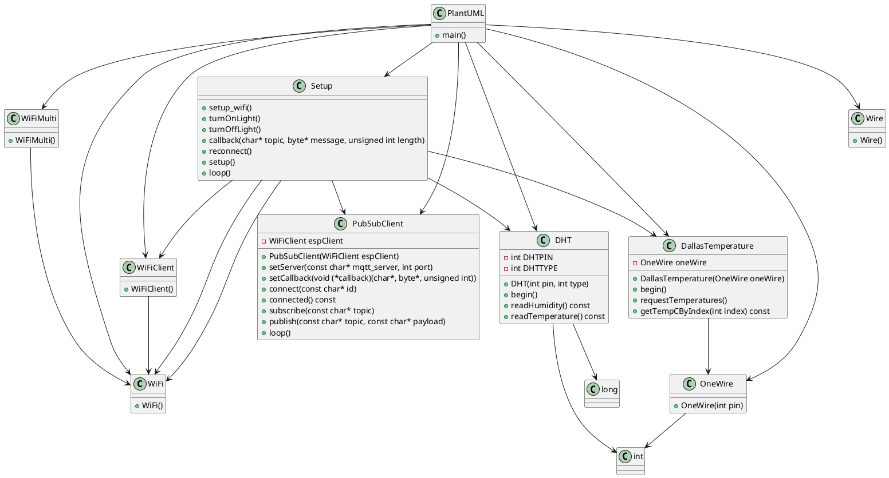

# Terrar1

Repo for the Mikrocontroller of Terra1

## Kurzbeschreibung

Diese C++ Anwendung ist ein MQTT-basiertes Sensordatenerfassungs- und -steuerungssystem, das auf einem ESP8266 Mikrocontroller läuft.

Die Sensoren, die verwendet werden, sind:

1. DHT11: Ein preiswerter Temperatur- und Feuchtigkeitssensor. Die Daten werden alle 30 Sekunden gelesen und an einen MQTT-Broker gesendet.
2. DS18B20: Ein digitaler Temperatursensor, der auf dem 1-Wire-Protokoll basiert. Die gemessene Temperatur wird ebenfalls an den MQTT-Broker gesendet.
3. Fotoresistor: Ein Lichtempfindlichkeits-Sensor, dessen Auslesung an den MQTT-Broker gesendet wird.
4. Bodenwiderstandssensor: Ein Sensor, der die Feuchtigkeit des Bodens misst. Die Messwerte werden an den MQTT-Broker gesendet.

Die Anwendung ermöglicht es auch, über MQTT-Befehle, das Licht ein- oder auszuschalten. Die entsprechenden MQTT-Themen lauten "terra1/light" mit den Nachrichten "lightOn" und "lightOff".

Die Anwendung stellt eine Verbindung zu einem WiFi-Netzwerk her und stellt sicher, dass sie während des gesamten Betriebs mit dem Netzwerk verbunden bleibt. Die SSID und das Passwort für das Netzwerk können in der Anwendung konfiguriert werden.

Die MQTT-Daten werden an einen MQTT-Broker gesendet, der in der Anwendung konfiguriert ist.

Während des Betriebs wird die Anwendung kontinuierlich die Sensorwerte lesen und an den MQTT-Broker senden. Wenn die Anwendung eine MQTT-Nachricht erhält, die das Licht ein- oder ausschaltet, wird sie das entsprechende Kommando ausführen.

Dieses Programm könnte in einem Umfeld wie einer Smart-Home-Automatisierung, einer Wetterstation oder einem Umweltüberwachungssystem eingesetzt werden. Es bietet die Grundlage für eine Vielzahl von IoT-Projekten, da es die Fernsteuerung von Geräten und die Fernüberwachung von Sensordaten ermöglicht.

## Use Case Diagramm

## Domain Model

