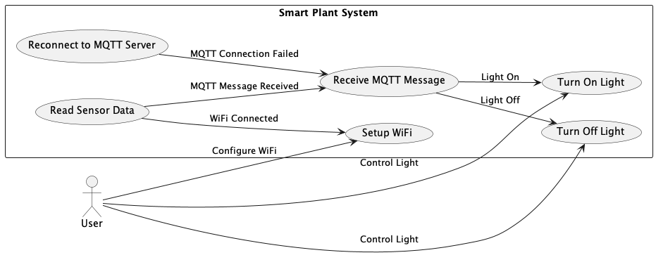

# Terra 1

Repo for the Mikrocontroller of Terra1

## Table of Contents

<!-- TOC -->
* [Terra 1](#terra-1)
  * [Table of Contents](#table-of-contents)
  * [Kurzbeschreibung](#kurzbeschreibung)
* [Design Phase](#design-phase)
  * [Use Case Diagramm](#use-case-diagramm)
  * [Domain Model](#domain-model)
  * [CRC Cards](#crc-cards)
  * [Use Case Specification](#use-case-specification)
    * [Use Case: Konfiguration der WiFi-Verbindung](#use-case-konfiguration-der-wifi-verbindung)
    * [Use Case: Überprüfung des WiFi-Verbindungsstatus](#use-case-überprüfung-des-wifi-verbindungsstatus)
    * [Use Case: Verbindung zum WiFi-Netzwerk herstellen](#use-case-verbindung-zum-wifi-netzwerk-herstellen)
    * [Use Case: Lokale IP-Adresse abrufen](#use-case-lokale-ip-adresse-abrufen)
    * [Use Case: Verbindung zum MQTT-Broker herstellen](#use-case-verbindung-zum-mqtt-broker-herstellen)
    * [Use Case: Überprüfung des Verbindungsstatus zum MQTT-Broker](#use-case-überprüfung-des-verbindungsstatus-zum-mqtt-broker)
    * [Use Case: MQTT-Themen abonnieren](#use-case-mqtt-themen-abonnieren)
    * [Use Case: MQTT-Nachrichten veröffentlichen](#use-case-mqtt-nachrichten-veröffentlichen)
    * [Use Case: Sensordaten lesen](#use-case-sensordaten-lesen)
    * [Use Case: Sensordaten als MQTT-Nachrichten veröffentlichen](#use-case-sensordaten-als-mqtt-nachrichten-veröffentlichen)
    * [Use Case: Eingehende MQTT-Nachrichten verarbeiten](#use-case-eingehende-mqtt-nachrichten-verarbeiten)
    * [Use Case: Hauptanwendung initialisieren und verwalten](#use-case-hauptanwendung-initialisieren-und-verwalten)
  * [Class Diagram](#class-diagram)
<!-- TOC -->

## Kurzbeschreibung

Diese C++ Anwendung ist ein MQTT-basiertes Sensordatenerfassungs- und -steuerungssystem, das auf einem ESP8266 
Mikrocontroller läuft.

Die Sensoren, die verwendet werden, sind:

1. DHT11: Ein preiswerter Temperatur- und Feuchtigkeitssensor. Die Daten werden alle 30 Sekunden gelesen und an einen MQTT-Broker gesendet.
2. DS18B20: Ein digitaler Temperatursensor, der auf dem 1-Wire-Protokoll basiert. Die gemessene Temperatur wird ebenfalls an den MQTT-Broker gesendet.
3. Fotoresistor: Ein Lichtempfindlichkeits-Sensor, dessen Auslesung an den MQTT-Broker gesendet wird.
4. Bodenwiderstandssensor: Ein Sensor, der die Feuchtigkeit des Bodens misst. Die Messwerte werden an den MQTT-Broker gesendet.

Die Anwendung ermöglicht es auch, über MQTT-Befehle, das Licht ein- oder auszuschalten. Die entsprechenden MQTT-Themen lauten "terra1/light" mit den Nachrichten "lightOn" und "lightOff".

Die Anwendung stellt eine Verbindung zu einem WiFi-Netzwerk her und stellt sicher, dass sie während des gesamten Betriebs mit dem Netzwerk verbunden bleibt. Die SSID und das Passwort für das Netzwerk können in der Anwendung konfiguriert werden.

Die MQTT-Daten werden an einen MQTT-Broker gesendet, der in der Anwendung konfiguriert ist.

Während des Betriebs wird die Anwendung kontinuierlich die Sensorwerte lesen und an den MQTT-Broker senden. Wenn die Anwendung eine MQTT-Nachricht erhält, die das Licht ein- oder ausschaltet, wird sie das entsprechende Kommando ausführen.

Dieses Programm könnte in einem Umfeld wie einer Smart-Home-Automatisierung, einer Wetterstation oder einem Umweltüberwachungssystem eingesetzt werden. Es bietet die Grundlage für eine Vielzahl von IoT-Projekten, da es die Fernsteuerung von Geräten und die Fernüberwachung von Sensordaten ermöglicht.

# Design Phase

According to module 326

## Use Case Diagramm

## Domain Model

## CRC Cards

**Class: WiFiManager**

Responsibilities:
- Configuriert die WiFi-Verbindung
- Überprüft den WiFi-Verbindungsstatus
- Stellt die Verbindung zum WiFi-Netzwerk her
- Gibt die lokale IP-Adresse zurück

Collaborators:
- WiFi
- WiFiMulti

**Class: PubSubClientManager**

Responsibilities:
- Stellt die Verbindung zum MQTT-Broker her
- Überprüft den Verbindungsstatus zum MQTT-Broker
- Abonniert MQTT-Themen
- Veröffentlicht MQTT-Nachrichten

Collaborators:
- WiFiClient
- PubSubClient

**Class: SensorManager**

Responsibilities:
- Liest die Sensordaten von DHT11, DS18B20, Photoresistor und Soil Resistor
- Konvertiert die Sensordaten in geeignete Formate
- Veröffentlicht die Sensordaten als MQTT-Nachrichten

Collaborators:
- DHTSensor
- DallasTemperatureSensor
- SoilSensor
- PubSubClient

**Class: LightController**

Responsibilities:
- Schaltet das Licht ein
- Schaltet das Licht aus

Collaborators:
- PubSubClientManager

**Class: MQTTMessageHandler**

Responsibilities:
- Verarbeitet eingehende MQTT-Nachrichten
- Ruft entsprechende Aktionen auf (z.B. Licht ein-/ausschalten)

Collaborators:
- PubSubClientManager
- LightController

**Class: MainApplication**

Responsibilities:
- Initialisiert und verwaltet die Hauptanwendung
- Verbindet alle Komponenten
- Steuert den Ablauf des Programms

Collaborators:
- WiFiManager
- PubSubClientManager
- SensorManager
- MQTTMessageHandler
- LightController

## Use Case Specification

Hier ist eine Übersicht der Use Case Specifications für die beschriebenen Use Cases, die mit dem zuvor erstellten Use Case-Diagramm synchronisiert sind:

### Use Case: Konfiguration der WiFi-Verbindung

**Beschreibung:**
Dieser Use Case beschreibt den Vorgang, bei dem die WiFi-Verbindung konfiguriert wird.

**Akteure:**
- Benutzer
- WiFiManager

**Vorbedingungen:**
- Die WiFiManager-Komponente ist initialisiert.

**Nachbedingungen:**
- Die WiFi-Verbindung wurde erfolgreich konfiguriert.

**Ablauf:**
1. Der Benutzer startet die Konfiguration der WiFi-Verbindung.
2. Das System fordert den Benutzer auf, die erforderlichen Informationen (z. B. SSID und Passwort) einzugeben.
3. Der Benutzer gibt die WiFi-Verbindungsinformationen ein.
4. Der WiFiManager konfiguriert die WiFi-Verbindung basierend auf den eingegebenen Informationen.
5. Das System bestätigt die erfolgreiche Konfiguration der WiFi-Verbindung.

**Alternative Abläufe:**
- Schritt 4a: Wenn die eingegebenen WiFi-Verbindungsinformationen ungültig sind:
    - Das System zeigt eine Fehlermeldung an.
    - Der Benutzer wird aufgefordert, gültige Informationen einzugeben.
    - Der Ablauf kehrt zu Schritt 3 zurück.

### Use Case: Überprüfung des WiFi-Verbindungsstatus

**Beschreibung:**
Dieser Use Case beschreibt den Vorgang, bei dem der WiFi-Verbindungsstatus überprüft wird.

**Akteure:**
- WiFiManager

**Vorbedingungen:**
- Die WiFiManager-Komponente ist initialisiert.

**Nachbedingungen:**
- Der WiFi-Verbindungsstatus wurde erfolgreich überprüft.

**Ablauf:**
1. Der WiFiManager überprüft den WiFi-Verbindungsstatus.
2. Das System gibt den aktuellen WiFi-Verbindungsstatus aus.

### Use Case: Verbindung zum WiFi-Netzwerk herstellen

**Beschreibung:**
Dieser Use Case beschreibt den Vorgang, bei dem eine Verbindung zum WiFi-Netzwerk hergestellt wird.

**Akteure:**
- WiFiManager

**Vorbedingungen:**
- Die WiFiManager-Komponente ist initialisiert.

**Nachbedingungen:**
- Die Verbindung zum WiFi-Netzwerk wurde erfolgreich hergestellt.

**Ablauf:**
1. Der WiFiManager stellt eine Verbindung zum WiFi-Netzwerk her.
2. Das System bestätigt die erfolgreiche Verbindung zum WiFi-Netzwerk.

### Use Case: Lokale IP-Adresse abrufen

**Beschreibung:**
Dieser Use Case beschreibt den Vorgang, bei dem die lokale IP-Adresse abgerufen wird.

**Akteure:**
- WiFiManager

**Vorbedingungen:**
- Die WiFiManager-Komponente ist initialisiert.
- Eine Verbindung zum WiFi-Netzwerk wurde erfolgreich hergestellt.

**Nachbedingungen:**
- Die lokale IP-Adresse wurde erfolgreich abgerufen.

**Ablauf:**
1. Der WiFiManager ruft die lokale IP-Adresse ab.
2. Das System gibt die abgerufene lokale IP-Adresse aus.

### Use Case: Verbindung zum MQTT-Broker herstellen

**Beschreibung:

**
Dieser Use Case beschreibt den Vorgang, bei dem eine Verbindung zum MQTT-Broker hergestellt wird.

**Akteure:**
- PubSubClientManager

**Vorbedingungen:**
- Die PubSubClientManager-Komponente ist initialisiert.

**Nachbedingungen:**
- Die Verbindung zum MQTT-Broker wurde erfolgreich hergestellt.

**Ablauf:**
1. Der PubSubClientManager stellt eine Verbindung zum MQTT-Broker her.
2. Das System bestätigt die erfolgreiche Verbindung zum MQTT-Broker.

### Use Case: Überprüfung des Verbindungsstatus zum MQTT-Broker

**Beschreibung:**
Dieser Use Case beschreibt den Vorgang, bei dem der Verbindungsstatus zum MQTT-Broker überprüft wird.

**Akteure:**
- PubSubClientManager

**Vorbedingungen:**
- Die PubSubClientManager-Komponente ist initialisiert.

**Nachbedingungen:**
- Der Verbindungsstatus zum MQTT-Broker wurde erfolgreich überprüft.

**Ablauf:**
1. Der PubSubClientManager überprüft den Verbindungsstatus zum MQTT-Broker.
2. Das System gibt den aktuellen Verbindungsstatus zum MQTT-Broker aus.

### Use Case: MQTT-Themen abonnieren

**Beschreibung:**
Dieser Use Case beschreibt den Vorgang, bei dem MQTT-Themen abonniert werden.

**Akteure:**
- PubSubClientManager

**Vorbedingungen:**
- Die PubSubClientManager-Komponente ist initialisiert.
- Eine Verbindung zum MQTT-Broker wurde erfolgreich hergestellt.

**Nachbedingungen:**
- Die MQTT-Themen wurden erfolgreich abonniert.

**Ablauf:**
1. Der PubSubClientManager abonniert die erforderlichen MQTT-Themen.
2. Das System bestätigt das erfolgreiche Abonnieren der MQTT-Themen.

### Use Case: MQTT-Nachrichten veröffentlichen

**Beschreibung:**
Dieser Use Case beschreibt den Vorgang, bei dem MQTT-Nachrichten veröffentlicht werden.

**Akteure:**
- PubSubClientManager

**Vorbedingungen:**
- Die PubSubClientManager-Komponente ist initialisiert.
- Eine Verbindung zum MQTT-Broker wurde erfolgreich hergestellt.

**Nachbedingungen:**
- Die MQTT-Nachrichten wurden erfolgreich veröffentlicht.

**Ablauf:**
1. Der PubSubClientManager veröffentlicht die MQTT-Nachrichten.
2. Das System bestätigt das erfolgreiche Veröffentlichen der MQTT-Nachrichten.

### Use Case: Sensordaten lesen

**Beschreibung:**
Dieser Use Case beschreibt den Vorgang, bei dem Sensordaten von verschiedenen Sensoren gelesen werden.

**Akteure:**
- SensorManager

**Vorbedingungen:**
- Die SensorManager-Komponente ist initialisiert.

**Nachbedingungen:**
- Die Sensordaten wurden erfolgreich gelesen.

**Ablauf:**
1. Der SensorManager liest die Sensordaten von DHT11, DS18B20, Photoresistor und Soil Resistor.
2. Das System gibt die gelesenen Sensordaten aus.

### Use Case: Sensordaten als MQTT-Nachrichten veröffentlichen

**Beschreibung:**
Dieser Use Case beschreibt den Vorgang, bei dem die gelesenen Sensordaten als MQTT-Nachrichten veröffentlicht werden.

**Akteure:**
- SensorManager

**Vorbedingungen:**
- Die SensorManager-Komponente ist initialisiert.
- Eine Verbindung zum MQTT-Broker wurde erfolgreich hergestellt.

**Nachbedingungen:**
- Die Sensordaten wurden erfolgreich als MQTT-Nachrichten veröffentlicht.

**Ablauf:**
1. Der SensorManager konvertiert die gelesenen Sensordaten in geeignete Formate.
2. Der SensorManager veröffentlicht die konvertierten Sensordaten als MQTT-Nachrichten.
3. Das System bestätigt das erfolgreiche Veröffentlichen der Sensordaten als MQTT-Nachrichten.

### Use Case: Eingehende MQTT-Nachrichten verarbeiten

**Beschreibung:**
Dieser Use Case beschreibt den Vorgang, bei dem eingehende MQTT-Nachrichten verarbeitet werden.

**Akteure:**
- MQTTMessageHandler

**Vorbedingungen:**
- Der MQTTMessageHandler ist initialisiert.
- Eine Verbindung zum MQTT-Broker wurde erfolgreich hergestellt.

**Nachbedingungen:**
- Die eingehenden MQTT-Nachrichten wurden erfolgreich verarbeitet.

**Ablauf:**
1. Der MQTTMessageHandler empfängt eine eingehende MQTT-Nachricht.
2. Der MQTTMessageHandler verarbeitet die eingehende MQTT-Nachricht und ruft die entsprechenden Aktionen auf (z. B. Licht ein-/ausschalten).

### Use Case: Hauptanwendung initialisieren und verwalten

**Beschreibung:**
Dieser Use Case beschreibt den Vorgang, bei dem die Hauptanwendung initialisiert und verwaltet wird.

**Akteure:**
- MainApplication

**Vorbedingungen:**
- Die erforderlichen Komponenten (WiFiManager, PubSubClientManager, SensorManager, MQTTMessageHandler, LightController) sind initialisiert und konfiguriert.

**Nachbedingungen:**
- Die Hauptanwendung wurde erfolgreich initialisiert und verwaltet.

**Ablauf:**
1. Die MainApplication initialisiert die erforderlichen Komponenten.
2. Die MainApplication verbindet alle Komponenten miteinander.
3. Die MainApplication steuert den Ablauf des Programms.

Dies sind die Use Case Specifications für die im zuvor erstellten Domain-Modell dargestellten Use Cases. Jeder Use Case 
hat eine klare Struktur mit Vorbedingungen, Nachbedingungen und einem detaillierten Ablauf. Die Use Case Specifications 
sind mit dem zuvor erstellten Use Case-Diagramm synchronisiert, um eine klare Darstellung der verschiedenen Use Cases 
und ihrer Beziehungen zu bieten.

## Class Diagram

